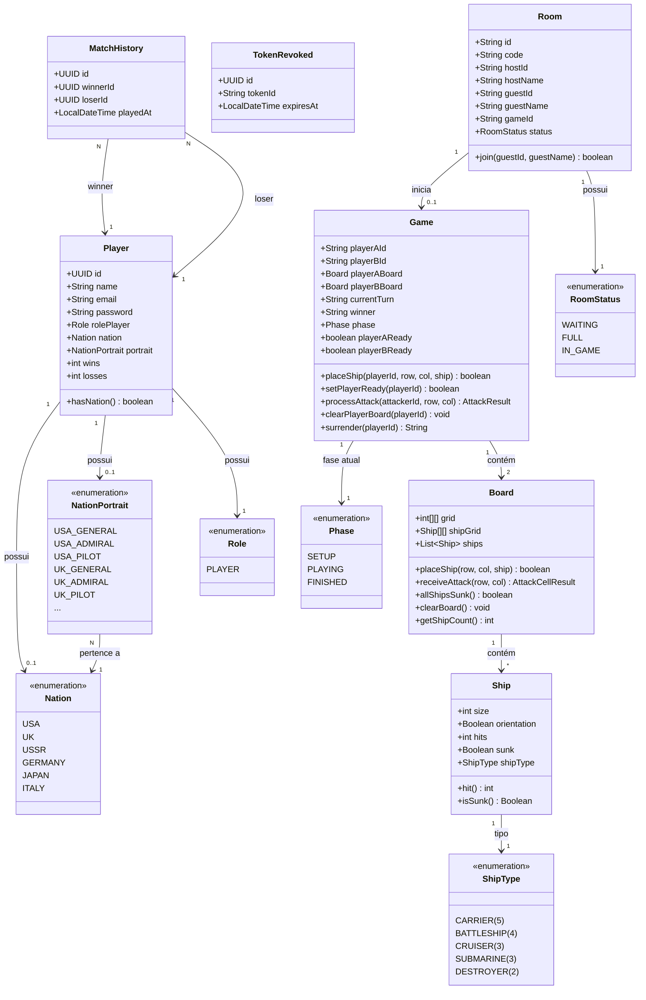
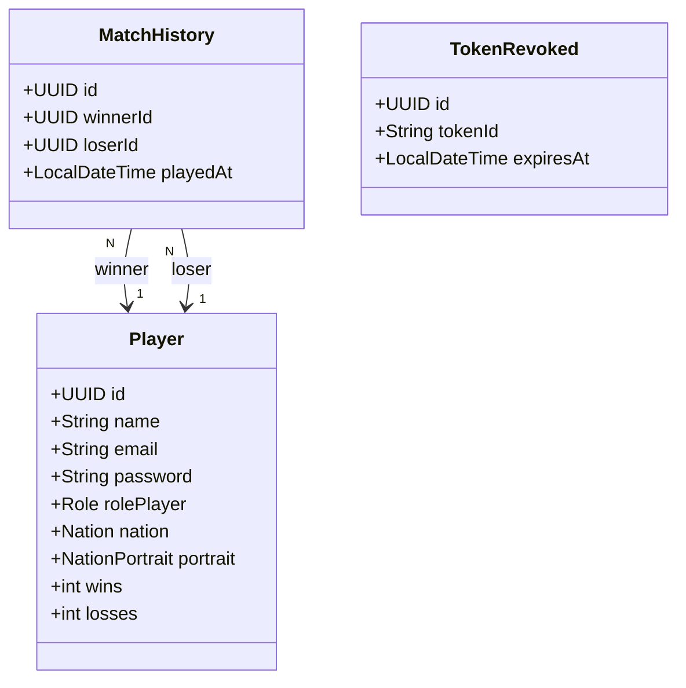
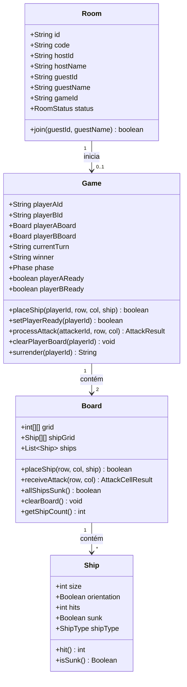

# Naval Warfare 1941 — Backend

API REST e servidor WebSocket do jogo multiplayer de Batalha Naval ambientado na Segunda Guerra Mundial, com matchmaking por salas, combate em tempo real por turnos e ranking competitivo.


---

## Visão Geral

**Naval Warfare 1941 Backend** é o servidor que gerencia toda a lógica de jogo, autenticação, persistência e comunicação em tempo real do projeto Batalha Naval. Ele expõe uma API REST para operações CRUD e autenticação JWT, além de um broker STOMP sobre WebSocket para a comunicação em tempo real durante as partidas.

### Funcionalidades Principais

- **Autenticação JWT** — registro, login e logout com tokens stateless e revogação
- **Gerenciamento de salas** — criação, listagem e ingresso em salas com código de 6 caracteres
- **Motor de jogo em memória** — lógica completa de Batalha Naval (posicionamento, ataques, turnos, vitória)
- **WebSocket STOMP** — comunicação bidirecional em tempo real com pub/sub por partida
- **Ranking competitivo** — classificação por winrate com mínimo de partidas
- **Histórico de partidas** — registro persistente de todas as vitórias e derrotas
- **6 nações e portraits** — suporte a seleção de nação e avatar do jogador
- **Documentação OpenAPI** — Swagger UI disponível em `/swagger-ui.html`

---

## Stack Tecnológica

| Camada         | Tecnologia                  | Versão |
| -------------- | --------------------------- |--------|
| Framework      | Spring Boot                 | 4.0.7  |
| Linguagem      | Java                        | 21     |
| Banco de Dados | PostgreSQL                  | 17      |
| ORM            | Spring Data JPA (Hibernate) | —      |
| Segurança      | Spring Security + JWT       | —      |
| WebSocket      | Spring WebSocket + STOMP    | —      |
| Documentação   | SpringDoc OpenAPI (Swagger) | 3.0.2  |
| Build          | Maven                       | —      |
| Deploy         | Docker + Render             | —      |
| Utilitários    | Lombok, java-dotenv         | —      |

### Justificativas

**Spring Boot 4** — Framework Java mais maduro e adotado para aplicações web enterprise. O ecossistema Spring oferece integração nativa entre REST, WebSocket, Security e JPA, eliminando a necessidade de bibliotecas externas para cada camada. A auto-configuração reduz boilerplate e acelera o desenvolvimento.

**Java 21 (LTS)** — Versão LTS com suporte de longo prazo, oferecendo virtual threads, pattern matching e records. A tipagem forte e o sistema de tipos do Java garantem segurança em tempo de compilação para a lógica de jogo complexa (validação de posicionamento, processamento de ataques, controle de turnos).

**PostgreSQL** — Banco relacional robusto e gratuito, ideal para dados estruturados como jogadores, histórico de partidas e ranking. Suporte nativo a UUID como chave primária e excelente performance para queries de agregação (cálculo de winrate).

**Spring Data JPA** — Abstração sobre Hibernate que elimina queries SQL manuais para operações CRUD. Repositories com query methods derivados aceleram o desenvolvimento. O `ddl-auto=update` simplifica migrações em fase de desenvolvimento.

**Spring Security + JWT** — Autenticação stateless ideal para SPAs. O JWT permite que o frontend armazene o token e o envie em cada requisição sem necessidade de sessão no servidor. A revogação de tokens (tabela `TokenRevoked`) adiciona segurança ao logout. O filtro JWT customizado (`JwtFilter`) intercepta e valida tokens antes de cada requisição protegida.

**STOMP sobre WebSocket (SockJS)** — Protocolo de mensagens que adiciona semântica pub/sub ao WebSocket bruto. O Spring integra STOMP nativamente com o broker simples em memória, permitindo tópicos públicos (`/topic/game/{id}`) para eventos de partida e filas pessoais (`/user/queue/...`) para respostas individuais. O SockJS fornece fallback para ambientes que não suportam WebSocket nativo. A autenticação WebSocket é feita via interceptor que valida o JWT no handshake STOMP.

**Docker** — Containerização com multi-stage build (JDK para compilação, JRE para execução) garante imagens leves e reprodutíveis. Facilita deploy em qualquer plataforma cloud sem configuração de ambiente.

**Render** — PaaS que suporta deploy direto de containers Docker com CI/CD automático via GitHub. Free tier adequado para projetos em fase de desenvolvimento/demonstração.

**Lombok** — Elimina boilerplate de getters, setters, construtores e builders nas entidades e DTOs, mantendo o código limpo e focado na lógica de negócio.

**SpringDoc OpenAPI** — Gera documentação interativa da API automaticamente a partir das anotações dos controllers, facilitando testes e integração com o frontend.

---

## Arquitetura

O projeto segue uma arquitetura em camadas com separação por domínio (Domain-Driven Design simplificado):

```
src/main/java/com/kaue/batalhanaval/
├── BatalhanavalApplication.java        # Entry point
├── commons/
│   └── enums/                          # Enums compartilhados
│       ├── Nation.java                 # Nações jogáveis (USA, UK, USSR, GER, JAP, ITA)
│       ├── NationPortrait.java         # Portraits dos comandantes
│       ├── Phase.java                  # Fases do jogo (SETUP, PLAYING, FINISHED)
│       ├── Role.java                   # Roles de usuário
│       ├── RoomStatus.java             # Status da sala (WAITING, FULL)
│       └── ShipType.java              # Classes de navios (5 tipos)
├── config/
│   ├── WebSocketConfig.java            # Configuração STOMP (endpoints, broker, heartbeat)
│   ├── WebSocketController.java        # Handlers de mensagens WebSocket (attack, place, ready, surrender)
│   ├── WebSocketAuthInterceptor.java   # Autenticação JWT no handshake STOMP
│   └── WebSocketDisconnectListener.java # Listener de desconexão
├── domain/
│   ├── auth/                           # Autenticação
│   │   ├── controller/                 # AuthController (login, register, logout)
│   │   ├── service/                    # Lógica de autenticação
│   │   ├── repository/                 # TokenRevoked repository
│   │   ├── entity/                     # TokenRevoked (revogação de JWT)
│   │   └── dto/                        # Request/Response DTOs
│   ├── player/                         # Jogador
│   │   ├── controller/                 # PlayerController (perfil, nação, portrait)
│   │   ├── service/                    # Lógica de jogador
│   │   ├── repository/                 # Player repository
│   │   ├── entity/                     # Player (JPA entity)
│   │   └── dto/                        # Request/Response DTOs
│   ├── room/                           # Salas de espera
│   │   ├── controller/                 # RoomController (criar, entrar, listar, fechar)
│   │   ├── service/                    # Lógica de salas (in-memory)
│   │   ├── entity/                     # Room (não persistida)
│   │   └── dto/                        # Request/Response DTOs
│   ├── game/                           # Motor do jogo
│   │   ├── controller/                 # GameController (estado, tabuleiros)
│   │   ├── service/                    # GameService (orquestra ações)
│   │   ├── entity/                     # Board, Ship (lógica de tabuleiro)
│   │   ├── dto/                        # Attack/Place/Event DTOs
│   │   └── Game.java                  # Classe principal do jogo (estado completo)
│   ├── match/                          # Histórico de partidas
│   │   ├── controller/                 # MatchHistoryController
│   │   ├── service/                    # Registro de partidas
│   │   ├── repository/                 # MatchHistory repository
│   │   ├── entity/                     # MatchHistory (JPA entity)
│   │   └── dto/                        # Response DTOs
│   └── ranking/                        # Ranking
│       ├── controller/                 # RankingController
│       ├── service/                    # Cálculo de ranking por winrate
│       └── dto/                        # Response DTOs
└── infra/
    ├── security/
    │   ├── SecurityConfig.java         # Configuração Spring Security (CORS, filtros, rotas)
    │   ├── JwtService.java             # Geração e validação de tokens JWT
    │   └── JwtFilter.java             # Filtro HTTP para validação de JWT
    └── exception/
        ├── GlobalExceptionHandler.java # Handler global de exceções (@ControllerAdvice)
        ├── ErrorResponse.java          # Resposta padronizada de erro
        ├── ValidationErrorResponse.java # Resposta de erros de validação
        └── FieldError.java             # Detalhe de erro por campo
```

### Decisões Arquiteturais

**Separação por domínio** — Cada módulo de negócio (auth, player, room, game, match, ranking) é auto-contido com controller, service, repository, entity e DTOs. Isso facilita a navegação, manutenção e eventual extração em microserviços.

**Game e Room em memória** — As salas e partidas não são persistidas no banco de dados. São gerenciadas em `ConcurrentHashMap` na camada de serviço. Isso garante performance máxima durante o jogo (sem I/O de banco a cada ataque) e simplifica a lógica de estado. O trade-off é que partidas em andamento são perdidas se o servidor reiniciar — aceitável para um jogo casual.

**Lógica de jogo sincronizada** — Os métodos de `Game.java` são `synchronized` para garantir consistência em cenários de concorrência (dois jogadores atacando simultaneamente, race conditions no "ready").

**Stateless REST + Stateful WebSocket** — A API REST é completamente stateless (JWT). O WebSocket mantém estado de conexão, mas a autenticação é feita via interceptor no CONNECT STOMP, reutilizando o mesmo JWT.

---

## Diagrama de Classes



---

## Modelo de Dados

### Entidades Persistidas (PostgreSQL)



### Entidades em Memória



---

## Comunicação WebSocket (STOMP)

### Endpoint de Conexão

```
ws://{host}/ws   (com SockJS fallback)
```

Autenticação via header `Authorization: Bearer {jwt}` no frame STOMP CONNECT.

### Mensagens (Client → Server)

| Destino                         | Payload              | Descrição                            |
| ------------------------------- | -------------------- | ------------------------------------ |
| `/app/game/{gameId}/place`      | `PlaceShipRequest`   | Posicionar um navio no tabuleiro     |
| `/app/game/{gameId}/clear`      | —                    | Limpar tabuleiro (fase setup)        |
| `/app/game/{gameId}/ready`      | —                    | Confirmar prontidão                  |
| `/app/game/{gameId}/attack`     | `AttackRequest`      | Atacar coordenada                    |
| `/app/game/{gameId}/surrender`  | —                    | Desistir da partida                  |

### Mensagens (Server → Client)

| Canal                           | Payload              | Descrição                            |
| ------------------------------- | -------------------- | ------------------------------------ |
| `/topic/game/{gameId}`          | `AttackResponse`     | Resultado de ataque (HIT/MISS/SUNK)  |
| `/topic/game/{gameId}`          | `GameEvent`          | Eventos (READY, STARTED, GAME_OVER, SURRENDERED) |
| `/user/queue/place-result`      | `String`             | OK / INVALID / BOARD_CLEARED         |
| `/user/queue/room-joined`       | —                    | Notificação de guest entrando        |
| `/user/queue/errors`            | `String`             | Mensagens de erro                    |

---

## API REST

### Autenticação (`/auth`)
- `POST /auth/register` — Cadastro de jogador
- `POST /auth/login` — Login (retorna JWT)
- `POST /auth/logout` — Logout (revoga token)

### Jogador (`/player`)
- `GET /player/me` — Perfil do jogador autenticado
- `PATCH /player/nation` — Selecionar nação (irreversível)
- `PATCH /player/portrait` — Alterar portrait

### Salas (`/rooms`)
- `POST /rooms` — Criar sala
- `POST /rooms/join` — Entrar por código
- `GET /rooms` — Listar salas disponíveis
- `DELETE /rooms/{id}` — Fechar sala

### Jogo (`/game`)
- `GET /game/{gameId}/state` — Estado atual do jogo
- `GET /game/{gameId}/boards` — Tabuleiros (visão do jogador)

### Ranking (`/ranking`)
- `GET /ranking` — Lista de jogadores por winrate

### Histórico (`/matches`)
- `GET /matches` — Histórico de partidas do jogador

Documentação interativa completa disponível em `/swagger-ui.html`.

---

## Como Rodar

### Pré-requisitos

- Java 21 (JDK)
- PostgreSQL
- Maven (ou usar o wrapper `mvnw`)

### Variáveis de Ambiente

Crie um arquivo `.env` na raiz (veja `.env.example`):

```env
DATABASE_URL=jdbc:postgresql://localhost:5432/batalhanaval
DATABASE_USERNAME=postgres
DATABASE_PASSWORD=sua_senha
JWT_SECRET=sua_chave_secreta
```

### Execução Local

```bash
# Instalar dependências e compilar
./mvnw clean install -DskipTests

# Rodar a aplicação
./mvnw spring-boot:run

# Ou via JAR
./mvnw clean package -DskipTests
java -jar target/batalhanaval-0.0.1-SNAPSHOT.jar
```

A aplicação será iniciada em `http://localhost:8080`.

### Docker

```bash
# Build da imagem
docker build -t batalhanaval-api .

# Rodar container
docker run -p 8080:8080 \
  -e DATABASE_URL=jdbc:postgresql://host:5432/batalhanaval \
  -e DATABASE_USERNAME=postgres \
  -e DATABASE_PASSWORD=senha \
  -e JWT_SECRET=segredo \
  batalhanaval-api
```

---

## Fluxo do Jogo (Backend)

```
POST /auth/register → POST /auth/login (JWT)
        │
        ▼
PATCH /player/nation (escolha irreversível)
        │
        ▼
POST /rooms (cria sala) ──ou── POST /rooms/join (entra por código)
        │
        ▼
WebSocket CONNECT (JWT no header)
        │
        ▼
/app/game/{id}/place (posicionar 5 navios)
        │
        ▼
/app/game/{id}/ready (confirmar prontidão)
        │
        ├── Ambos prontos → GameEvent(GAME_STARTED)
        │
        ▼
/app/game/{id}/attack (turnos alternados)
        │
        ├── HIT → mesmo jogador continua
        ├── MISS → troca turno
        ├── SUNK → navio afundado
        └── GAME_OVER → partida registrada no histórico
```

---

## Deploy

O backend é deployado no **Render** via Docker. O Dockerfile usa multi-stage build:

1. **Stage build** — Eclipse Temurin JDK 21 compila o projeto com Maven
2. **Stage runtime** — Eclipse Temurin JRE 21 executa apenas o JAR final

Isso resulta em uma imagem ~60% menor comparada a usar JDK em runtime.

---

## Frontend

O frontend React está disponível em repositório separado e deployado na Vercel:

- **Repositório**: [Frontend]([naval-warfare-taupe.vercel.app]) SPA em React 19 + Vite + Tailwind CSS 
- **Produção**: [naval-warfare-taupe.vercel.app](https://naval-warfare-taupe.vercel.app/)

---

## Testes

```bash
# Rodar todos os testes
./mvnw test

# Testes de uma classe específica
./mvnw test -Dtest=BoardTest
```

O projeto inclui testes unitários para as entidades de domínio (Board, Ship, Player, Room).
